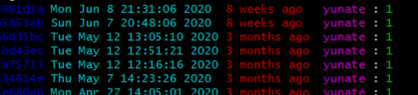

### alias
```bat
git config --global alias.ci "commit"
git config --global alias.st "status"
git config --global alias.co "checkout"
git config --global alias.amd "commit --amend"
git config --global alias.br "branch"
git config --global alias.cp "cherry-pick"
git config --global alias.ll "log --pretty=format:'%C(blue)%h%Creset %C(cyan)%<(26,trunc)%cd%x08%x08%Creset %C(red)%<(13,trunc)%ar%Creset %C(magenta)%an%Creset : %C(green)%s%Creset'"
```

### 格式化日志
```bat
git config --global alias.ll "log --pretty=format:'%C(blue)%h%Creset %C(cyan)%<(26,trunc)%cd%x08%x08%Creset %C(red)%<(13,trunc)%ar%Creset %C(magenta)%an%Creset : %C(green)%s%Creset'"
```
结果如图:



### 强制更新节点到远程，忽略本地所有修改：
```bat
git fetch --all
git reset --hard origin/master
```

### 合并不同仓库：
```bat
将B库（地址b_url）合并到A库（a_url）
1、创建文件夹，并且进入文件夹
2、 git init                    // 初始化一个git工作区间
3、 git remote add A a_url      // 添加A的远程地址
4、 git remote add B b_url      // 添加B的远程地址
5、 git fetch A master          // 拉取A仓库，区别于拉取分支，这里是将整个仓库拉取下来
6、 git fetch B master          // 拉取B仓库，区别于拉取分支，这里是将整个仓库拉取下来
7、 git branch br_a A/master    // 创建br_a分支，第5步后只是拉取了git的整个仓库，此时还没有分支
8、 git branch br_b B/master    // 创建br_b分支，第6步后只是拉取了git的整个仓库，此时还没有分支
9、 git checkout br_a           // 切换到br_a分支
10、git cherry-pick commitid    // commitid 标识br_b的提交id，你要合并那个代码就选取哪个，也可以直接git merge --allow-unrelated-histories br_a，这样会合并所有
11、解决冲突

补充：拉取远程分支
1、没有仓库的情况下，可以使用1~9的步骤，有仓库的话那么直接7~9
2、没有仓库的情况下，使用 git clone a_url ./ -b master 直接到第9步 // “./”表示克隆到当前目录，不加这个的话，克隆下来会嵌套一层仓库名称的顶层目录；“-b master” 指定分支
```
