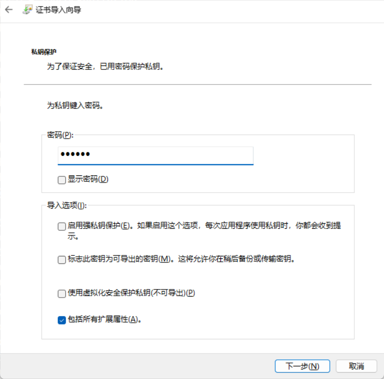

### 什么是自签名证书?
一个证书通常包含两个部分: Subject(使用者) + Issuer(颁发者)

每个证书都有一个上级（颁发者），直到根证书 **[当前证书] --> [颁发者证书] --> [颁发者的颁发证书] --> ... --> [根证书]**

自签名证书(根证书)的颁发者是它自己 **[当前证书] --> [颁发者证书(当前证书)]**


#### PC(windows)是如何验证一个证书是否有效呢?
Windows 会从叶子证书(**当前证书**)开始，逐级验证，直到找到一个受信任的根证书

#### PC是如何判断根证书是否受信任?
Windows 有一个本地的「受信任根证书颁发机构」存储区（Trusted Root Certification Authorities） 如果证书链中的根证书在这个存储区中，那说明是受信任的

### 为什么要制作一个自签名证书?
主要是出于测试目的.
- 比如我们在本地部署了一个https服务器, 我们要为其提供一证书, 我们可以向证书机构申请一个证书使用, 但申请过的都知道这是这非常麻烦的, 因此我们想要自己制作一个证书, 并将其放到windws的「受信任根证书颁发机构」中, 这样我们就可以使用这个证书作为测试使用.
- 有时候我们需要为一个可执行文件签名, 特别是在测试一个驱动的时候, 如果这个驱动文件没有签名windows会拒绝安装, 这个时候我们就需要使用一个测试根证书为其签名.

### 如何制作一个自签名文件?
我们使用OpenSSL来生成证书, 所以要先安装OpenSSL, 然后使用以下脚本(bat脚本):
```bat
:: openssl.exe所在路径
SET openssl_rootpath="C:\Program Files\OpenSSL-Win64\bin"

:: 生成的文件存放路径
SET rootpath="F:\My\ddwork_space\dd\projects\test\res\cret"

:: 生成pfx名称: XXX.pfx
SET name=ddm

:: 生成的pfx密码
SET psw=123456

:: 删除并重新生成 openssl.cfg  
del %rootpath%\openssl.cfg  
(@echo [ req ]
@echo default_bits = 2048
@echo distinguished_name = req_distinguished_name
@echo req_extensions = v3_req
@echo prompt = no

@echo [ req_distinguished_name ]
@echo C = CN
@echo ST = YourState
@echo L = YourCity
@echo O = YourOrganization
@echo OU = YourUnit
@echo CN = localhost

@echo [ v3_req ]
@echo keyUsage = critical, digitalSignature, keyEncipherment
@echo extendedKeyUsage = serverAuth, codeSigning
@echo basicConstraints = critical,CA:FALSE
@echo subjectAltName = @alt_names

@echo [ alt_names ]
@echo DNS.1 = localhost
@echo IP.1 = 127.0.0.1)>%rootpath%\openssl.cfg
:: @echo subjectAltName = @alt_names 是必须的,浏览器会验证

:: 生成私钥
%openssl_rootpath%\openssl genrsa -out %rootpath%\tmp_private.key 2048
:: 生成csr
%openssl_rootpath%\openssl req -new -key %rootpath%\tmp_private.key -out %rootpath%\tmp.csr -config %rootpath%\openssl.cfg
:: 生成crt
%openssl_rootpath%\openssl x509 -req -days 3650 -in %rootpath%\tmp.csr -signkey %rootpath%\tmp_private.key -out %rootpath%\tmp.crt -extensions v3_req -extfile %rootpath%\openssl.cfg
:: 生成自签名pfx
%openssl_rootpath%\openssl pkcs12 -export -out %rootpath%\%name%.pfx -inkey %rootpath%\tmp_private.key -in %rootpath%\tmp.crt -name "%name%" -passout pass:%psw%

:: 删除中间文件
del %rootpath%\tmp_private.key
del %rootpath%\tmp.csr
del %rootpath%\tmp.crt
del %rootpath%\openssl.cfg
```

生成完成后双击生成XXX.pfx文件安装:


下一步中的密码是脚本中指定的密码



**一定要选择: 将所有的证书到放到下列存储 -然后点击浏览 -选择受信任的根证书颁发机构**


点击完成即可完成安装


